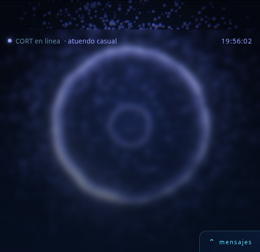

# CORT

<p align="center">
  
  
  
  
  
  
  
</p>

**C**ognitive **O**perating **R**eactive **T**echnology — un asistente personal holográfico, **local-first**, inspirado en Cortana (*Halo*).

No una maqueta: un orbe de shader que respira, **una voz que se oye**, una memoria que sobrevive al apagar, un cerebro que puede ser un modelo tuyo o un chat local, y una capa de permisos que hace las cosas en el sistema real — con una llave delante cuando asoma el puerto a la red. Corre en un portátil de **1,8 GiB de RAM y sin tarjeta gráfica**, porque si corriera en una máquina de 128 GiB no valdría nada como prueba de concepto.

**Prototipo actual: `v0.7.0`** · rama **`main`** · **257 pruebas en verde** (ejecutadas, no contadas) · licencia MIT · creadores **Sandra Lopez** y **Askher Vargas**.



> **Descargar / probar:** [`git clone https://github.com/Sandra2244/CORT.git`](https://github.com/Sandra2244/CORT) ·
> [ZIP de la última versión](https://github.com/Sandra2244/CORT/archive/refs/heads/main.zip) ·
> [Instalación paso a paso ↓](#instalación)

---

## Índice

| | | |
|---|---|---|
| [Arquitectura](#arquitectura) | [Voz](#voz) | [Instalación](#instalación) |
| [Componentes](#componentes) | [Funciones](#funciones) | [Si algo no arranca](#si-algo-no-arranca) |
| [Protocolo WebSocket](#protocolo-websocket) | [Qué hace hoy, y cómo se sabe](#qué-hace-hoy-y-cómo-se-sabe) | [Cómo colaborar](#cómo-colaborar) |
| [La red y su llave](#la-red-y-su-llave) | [Plataforma y hardware](#plataforma-pc-móvil-y-por-qué-no-cjava) | [Créditos y licencia](#créditos) |
| [Seguridad y permisos](#seguridad-y-permisos) | [Estructura del repositorio](#estructura-del-repositorio) | [Documentación](#documentación) |

---


## Arquitectura

Tres capas, un protocolo, y todo en la misma máquina. Ningún dato sale del equipo salvo que tú configures un modelo remoto (no es el caso).

```
        Usuario (voz* · teclado · táctil · cámara)
                     │
   ┌─────────────────▼──────────────────┐
   │  apps/web   React 19 · Vite · TS   │  interfaz: reactor GLSL, HUD, chat,
   │  Three.js r185 · post-proceso      │  telemetría, efectos, PWA
   └─────────────────▲──────────────────┘
                     │  WebSocket JSON (ws://127.0.0.1:8765/ws)
   ┌─────────────────┴──────────────────┐
   │  services/core   Python 3.13       │  FastAPI + websockets, sin framework
   │  brain · intents · actions ·       │  de app: un módulo por responsabilidad
   │  memory · status · outfit · avatars│
   └───▲──────────────▲─────────────▲───┘
       │              │             │
   Ollama        SQLite         capa de permisos
   (LLM local)   (memoria)      (wpctl · scrot · xdotool · apps)
                                     │
                               sistema real

   * voz: la del navegador — habla y escucha sin gastar RAM del core; escuchar
     necesita internet (ver [Voz](#voz))
```

Un mensaje recorre el sistema así (cada paso está probado, `test_protocol.py`):

1. El cliente manda `{"type":"user_message","text":…}`.
2. `memory/facts.py` extrae hechos declarables («me llamo Sandra» → `El usuario se llama Sandra`) y `memory/store.py` los guarda **antes** de cualquier otra cosa.
3. `intents.py` mira si la frase es una orden local («baja el volumen»). Si lo es, **no se gasta el LLM**.
4. Si es una orden, `actions.py` la ejecuta por la lista cerrada de permisos y **comprueba el resultado en el mundo** (nivel de volumen, archivo en disco, recuento de procesos).
5. Si no, `brain.py` pregunta a Ollama con los recuerdos relevantes metidos como mensaje de sistema.
6. Vienen `assistant_message`, un `effect` (`pulse` si la acción fue, `glitch` si falló) y un `status` con lo que CORT puede afirmar de sí mismo.

## Componentes

| Componente | Archivo(s) | Qué hace |
|---|---|---|
| **Servidor y protocolo** | `services/core/cort_core/server.py` | FastAPI + WebSocket. Reparte los siete marcos que salen del core (y escucha los dos que entran: `user_message` y `list_avatars`), sirve los archivos de atuendo por `GET /avatars/{nombre}`, arma el prompt con memoria y decide si el turno pasa por el modelo o por un atajo local. Toda llamada al sistema va en `await` sobre `asyncio.create_subprocess_exec`: un `subprocess.run` bloqueante pararía el bucle que atiende a los demás clientes |
| **Cerebro (LLM)** | `cort_core/brain.py` | Cadena de sustitución (`CORT_LLM_CHAIN`): usa el primer modelo que responda. Pide `/api/tags` y **descarta por tamaño** lo que no cabe en RAM (`CORT_LLM_MAX_MODEL_MIB`, 700 MiB) — cargar el de 2,6 GB congeló la máquina. Distingue «Ollama no está» de «la cadena no respondió». Sin modelo, modo eco |
| **Memoria persistente** | `cort_core/memory/{store,facts}.py` | SQLite con búsqueda por raíces de 4 letras (no embeddings: esos piden ~1,5 GiB). `remember · recall · context_for · prune · name_of_user · count`. `prune` protege la fila del nombre, de la que depende el saludo. `context_for` rescata **por contenido, no por fecha** |
| **Intenciones** | `cort_core/intents.py` | Patrones locales para órdenes de sistema. Devuelve una acción estructurada y **no ejecuta nada** — separar las dos cosas es lo que hace auditable el permiso |
| **Capa de permisos** | `cort_core/actions.py` | Convierte esa acción en un comando real **de una lista cerrada**, con argv fijo, verificación del resultado y apagador global. Es la frontera entre «CORT entendió» y «CORT lo hizo» |
| **Puerta de red** | `cort_core/security.py` | Cinco funciones puras que deciden quién puede hablarle a CORT cuando el puerto asoma a la Wi-Fi: sin `CORT_LAN_TOKEN` **no se abre** (el lanzador y el propio módulo de arranque se niegan con código 1), en `127.0.0.1` no se pide nada, el vecino de bucle invertido entra sin llave aunque esté publicado, y la comparación es de **tiempo constante**. El WebSocket se rechaza **antes de `accept()`** para no regalar un lazo abierto con su tarea de iniciativa |
| **Telemetría** | `cort_core/status.py` | Lee tres cosas y nada más: cuántos recuerdos hay, qué modelo habló la última vez y si los permisos están encendidos. Si un valor no se puede medir manda `null`, no un adorno |
| **Atuendo** | `cort_core/outfit.py` | El color del holograma según hora y temperatura, igual que el de Cortana |
| **Atuendos en disco** | `cort_core/avatars.py` | El catálogo de archivos que la usuaria pone en `CORT_AVATAR_DIR`: lista, sirve y **no se fía de ninguna ruta ajena**. Tres guardas, en este orden: nombre contra una expresión cerrada, `resolve()` + `relative_to()` sobre la raíz (no `startswith`, que se cuela con `/raiz-otra`), y extensión dentro de un mapa cerrado. Fuera de esa carpeta responde 404 —no 403, para no revelar que algo existe— |
| **Clima** | `cort_core/weather.py` | Open-Meteo sin clave de API: resuelve la ciudad una vez, refresca cada 15 min y **sirve caché**, nunca una petición dentro del bucle del WebSocket. Si el servicio falla devuelve la última foto y deja de afirmarla pasados tres TTL. Sin `CORT_CITY` no sale ningún paquete de la máquina |
| **Configuración** | `cort_core/env.py` | El lector de `.env`: un solo parser para el core y el lanzador, para que no puedan discrepar en qué puerto están. Una variable exportada gana; `CORT_DOTENV=0` anula el archivo (lo usan las pruebas) |
| **Reactor holográfico** | `apps/web/src/scene/{Core,Particles,Scene}.tsx` | Un solo quad con shader de coordenadas polares (anillo erosionado por fbm, polvo, barrido radar) + Bloom, aberración cromática, ruido y viñeta. **18 fps sin GPU**, y los mismos a 200 % de tamaño |
| **Cuerpo 3D (VRM)** | `apps/web/src/scene/Vrm.tsx` | Un `.vrm` montado **dentro del mismo canvas** del reactor (dos contextos WebGL en esta máquina son dos colas de GPU y la mitad de cuadros). Se le reemplaza el material por uno estándar parcheado con `onBeforeCompile` — el skinning y los morph targets los resuelve Three sólo si el programa sigue siendo el de `MeshStandardMaterial`—, se tiñe con la paleta del atuendo y se le baja el húmero de la pose en cruz escribiendo sobre el hueso **crudo** con `autoUpdateHumanBones = false`. El shader es propio: los dos repositorios que imitan este aspecto son AGPL-3.0 y su código no entra (regla 9) |
| **Estado y conexión** | `apps/web/src/cort/{connection,palette}.ts` | Dos capas deliberadamente separadas: un *snapshot* inmutable para React (`useSyncExternalStore`) y un objeto mutable que la escena persigue con `lerp`. Por eso cambiar de atuendo **respira** en vez de parpadear, y por eso el orbe **crece** en vez de saltar. Un solo archivo define todo el color |
| **Interfaz** | `apps/web/src/ui/{Hud,Telemetry,Effects,Bandeja,Avatar,Temporizador}.tsx` + `cort/arrastre.ts` | Chat con reloj, clima medido en el cabezal, **bandeja que se guarda en la esquina**, **panel que se arrastra con el dedo o con el ratón** y topes para que no se pierda fuera de la pantalla, cuenta atrás que sólo existe mientras se pide, panel de «lo que CORT sabe de sí mismo», capa de efectos de un solo disparo y **proyección del cuerpo con atuendo**. El tamaño del reactor no tiene deslizador: lo manda la cámara. Escritos **sin** `zustand`, `drei` ni `framer-motion`: cada dependencia es RAM que esta máquina no tiene |
| **Gestos de cámara** | `apps/web/src/cort/defocus.ts` + `lib/oneEuro.ts` | Desenfocar con los dedos delante de la webcam encoge el orbe y enfocar lo devuelve. Sin modelos ni dependencias: 64×48 píxeles a 5 muestras por segundo, gris BT.601 y **varianza del Laplaciano** — el criterio con el que cualquier cámara decide si ya enfocó. Lo que suaviza esa señal es un **filtro 1€** (MIT, transplantado y **reajustado midiendo**): menos temblor con la mano quieta y la mitad de retardo moviéndola, que un factor fijo no puede dar las dos cosas a la vez. La cámara la abre un botón de la usuaria y apagarla detiene las pistas del stream |
| **Voz** | `apps/web/src/ui/Voz.tsx` | Habla con `speechSynthesis` y escucha con `SpeechRecognition`: **cero dependencias, cero RAM del core, y el mismo código en el portátil que en el Android**. Elige la mejor voz en español puntuando las instaladas (`Natural` > `online` > resto, región primero), limpia el markdown y los emojis que el sintetizador deletrea, parte por oraciones para que haya pausas, y **cierra el micrófono mientras CORT habla** para no oírse a sí misma |
| **Capa instalable** | `apps/web/public/manifest.webmanifest`, `public/icons/` | `display: standalone`, tema `#02040c` y cuatro iconos generados con código propio a partir de `palette.ts`. **Sin service worker a propósito**: cachear una interfaz que depende del core daría un CORT que parece vivo sin estarlo |
| **Lanzador** | `scripts/cort.py` + `CORT.desktop` + `cort.bat` | La única puerta soportada para encenderlo todo: banner de marca y **siete barras de estado** (core · interfaz · ollama · memoria · **audio** · **cámara** · red). Sin dependencias, ANSI con la estándar. `--demo` manda la memoria a `/tmp`; `--lan` es lo único que saca CORT de `127.0.0.1` |
| **Pruebas** | `services/core/tests/` | 257, con la biblioteca estándar. El Ollama y el clima se fingen con `httpx.MockTransport`, el ejecutor de acciones con un `runner` inyectable, la red con un `CORT_HOST` y un `CORT_LAN_TOKEN` de mentira, y los atuendos con un directorio falso en `tempfile`: **la suite no le mueve el audio, no le escribe la memoria a nadie, no le lee su carpeta de modelos y no hace una sola petición a internet** |

## Protocolo WebSocket

`ws://127.0.0.1:8765/ws`, JSON plano: **once tipos**, dos entrantes y nueve salientes. Cuando el core está publicado en la red, el lazo y la ruta de archivos piden además `?token=…` (ver [La red y su llave](#la-red-y-su-llave)). Los tipos nuevos se escriben aquí y en `docs/ARCHITECTURE.md` **antes** de programarlos (regla 5 de `AGENTS.md`).

| Tipo | Dirección | Lleva | Quién lo pinta |
|---|---|---|---|
| `user_message` | cliente → core | `text` | — |
| `list_avatars` | cliente → core | — (lo dispara abrir el selector de atuendos) | — |
| `state` | core → cliente | `outfit`, `mood`, `thinking`, y `city` + `temp_c` **solo si el clima está medido** | reactor y HUD |
| `greeting` | core → cliente | `text`, `mood` | el chat, **sólo si el registro está vacío** (viaja separado de `assistant_message` porque el core lo manda en cada reconexión) |
| `assistant_message` | core → cliente | `text`, `mood` | el chat |
| `intent` | core → cliente | `action`, `delta`/`app` | trazabilidad de la orden |
| `effect` | core → cliente | `kind` ∈ `glitch · pulse · scan · shake · flash` | capa de efectos (no se guarda: es puntuación, no estado). Hoy el core produce tres: **`pulse`** al ejecutar una orden, **`glitch`** cuando falla y **`shake`** al terminar cualquier respuesta del modelo — la pantalla tiembla con la contestación ya en pantalla, que es lo que pidió la dueña del proyecto (`vibra al responder`). `scan` y `flash` siguen esperando productor |
| `status` | core → cliente | `memories`, `keep`, `brain`, `ollama`, `actions`, `iniciativa` | panel de telemetría |
| `avatars` | core → cliente | `items`: `nombre`, `mime`, `bytes` (lista vacía si no hay `CORT_AVATAR_DIR`) | mosaico táctil de atuendos. Los bytes no van por aquí: se cargan con `` desde `GET /avatars/{nombre}` |
| `proactive` | core → cliente | `text`, `mood`, `clave` | el chat, **sin que nadie haya preguntado**: es la iniciativa, y `clave` es el tema ya dicho en esta conexión para que no suene a alarma. No lleva orden ninguna — sale de `initiative.py`, que no importa `actions` y no puede ejecutar nada |
| `timer` | core → cliente | `restante`, `total`, `estado` ∈ `corre · termina · cancela` | el anillo de cuenta atrás (`ui/Temporizador.tsx`). **Un cuadro por segundo y sólo mientras hay cuenta atrás**: no hay temporizador en el navegador, así que si el core se apaga el número se apaga con él. Sale de `timer.py`, que no importa `actions` ni `subprocess` y no puede ejecutar nada. Se pide en texto («pon un temporizador de 5 minutos») y se cancela igual |

## Voz

CORT **habla y escucha**, y lo hace con lo que ya trae el navegador: `apps/web/src/ui/Voz.tsx`. No hay un servicio de voz que levantar, no hay un modelo que descargar, y el mismo archivo corre en el portátil de 1,8 GiB y en un teléfono.

Dos botones en la bandeja (la esquina que abre el panel):

| Botón | Qué hace | Qué necesita |
|---|---|---|
| **«que me hable»** | Lee en voz alta cada respuesta de CORT. Elige la mejor voz en español que haya en el sistema — primero las *Natural* de Edge, luego por región (`es-CO`, `es-MX`…) —, quita el markdown y los emojis que el sintetizador deletrea y parte por oraciones para que haya pausas | Altavoz o auriculares. Nada más |
| **«hablarle»** | Abre el micrófono y conversa: escucha, manda lo dicho al core, **cierra el micrófono mientras CORT responde** (si no, se oiría a sí misma) y lo reabre al terminar | Permiso de micrófono **e internet**: en Chrome y Edge el reconocimiento lo hace un servicio en línea |

Lo dicho, sin adornos: **hablar es local; escuchar no lo es todavía.** El reconocimiento de `SpeechRecognition` es un servicio de Google (Chrome) o de Microsoft (Edge), así que la muestra de audio sale de la máquina mientras se transcribe. Está escrito aquí, en el aviso de la propia interfaz y en `docs/ARCHITECTURE.md`, porque un proyecto que se llama *local-first* tiene que decir dónde no lo es.

**Por qué no Whisper local, medido:** `faster-whisper` pide un modelo de 74 MB (`tiny`) a 1,5 GB (`base`) y esta máquina tiene **1,8 GiB de RAM en total** con Ollama ya ocupando parte de ella. No es «lento»: es congelar el equipo, que ya se congeló una vez por intentar un modelo de 2,6 GB. El camino real pasa por `services/voice` en otro equipo o por un modelo cuantizado cuando quepa, y está anotado como deuda en `docs/STATUS.md`, no como promesa.

**Lo que sigue abierto:** el *wake word* («Oye CORT», función 11) pide un motor de escucha permanente y hoy no lo hay; el **lip-sync** del cuerpo 3D (función 27) necesita casar el `SpeechSynthesis` con los morph targets de la boca, que es trabajo de interfaz y no de hardware; y una voz elegible por la usuaria (función 22) está a un selector de distancia.

## La red y su llave

El core escucha en `127.0.0.1`, y así se queda por defecto: **por ese WebSocket se cambia el volumen, se abren aplicaciones y se captura la pantalla**. Publicarlo en la Wi-Fi para abrirlo desde el teléfono (`--lan`) sin más sería prestarle el PC a todo el que esté conectado al router.

Así que la red tiene una condición, escrita en `cort_core/security.py`:

1. **Sin `CORT_LAN_TOKEN` no se abre el puerto.** Ni el lanzador (`cort.py --lan`) ni el módulo de arranque (`python -m cort_core.server` con `CORT_HOST=0.0.0.0`): los dos se niegan, salen con código 1 y **imprimen la línea exacta que falta**, con un secreto generado para copiar. Un puerto abierto por olvido de una variable es el caso que esta regla cierra.
2. **En local no se pide nada.** No hay a quién autorizar en `127.0.0.1`, y exigir una llave ahí sería un paso de más para la dueña del portátil. Publicado el puerto, el bucle invertido **sigue** entrando sin llave: el portátil puede estar en `--lan` para el teléfono y seguir abriéndose a sí mismo como siempre.
3. **La llave viaja por la URL** (`?token=…`), que es lo que imprime el lanzador ya puesto en la dirección del móvil. No es una cabecera porque el `WebSocket` del navegador y un `` de una miniatura no pueden mandar una `Authorization`.
4. **Se compara en tiempo constante y antes de tocar el disco.** Un archivo pedido desde la red sin llave responde **401**, no 404, para no confirmar qué nombres existen; y el WebSocket se cierra con **4401 antes de `accept()`**, para no regalar un lazo abierto con su tarea de iniciativa y su saludo.

Y lo que **no** es: un túnel cifrado. Sin TLS el secreto va en claro por la Wi-Fi, así que protege de quien pasa por ahí, no de quien escucha el aire. La barra de red lo dice en la misma línea donde imprime la dirección, y HTTPS en la LAN sigue siendo la salida de verdad (función 66 y `docs/PLATFORM.md`).

## Seguridad y permisos

Lo que hace a esto una capa de permisos y no un `subprocess` suelto:

1. **Lista cerrada.** Sólo hay cuatro mandos: `volume`, `media`, `screenshot`, `launch`. Todo lo demás responde «no está en la lista permitida» con un `glitch`, en vez de fingir un «entendido».
2. **argv fijo.** No existe `shell=True`, y ni el texto del usuario ni la salida del modelo entran en los argumentos: sólo un entero que sale de *nuestra* tabla de patrones y claves de una constante.
3. **El LLM no tiene herramientas.** `brain.py` devuelve texto y ese texto se pinta. No hay camino del modelo al shell.
4. **Se puede apagar sin tocar código:** `CORT_SYSTEM_ACTIONS=0`.
5. **El resultado se comprueba, no se supone:** el nivel se lee antes y después, la captura se mira en disco, la app se cuenta con `pgrep`. Un `returncode` 0 no es una prueba.
6. **Datos personales fuera de git.** La base vive en `services/core/data/` (ignorada), `.env` está ignorado, y las claves no se suben nunca. Para enseñar CORT a otra persona existe `--demo`.
7. **La iniciativa habla, no actúa.** `initiative.py` no importa `actions` ni `subprocess`, y lo que devuelve `sugerir()` es una `Sugerencia` con dos campos de texto. Hay una prueba que lo comprueba leyendo el árbol de sintaxis del módulo (`test_initiative.py`), porque un `import` añadido en un merge no se ve en ninguna otra prueba. Se apaga con `CORT_INITIATIVE=0`.
8. **El temporizador tampoco toca nada.** `timer.py` cuenta segundos y devuelve números; la cuenta atrás se pinta en la interfaz y no ejecuta un mando, no suena y no escribe en disco. Su lista de `import`s está cerrada por prueba en `test_timer.py` (`__future__, asyncio, re, typing`), y la tarea muere al cancelar ella o al cerrarse la conexión — no queda reloj corriendo hacia una pestaña que ya no está.
9. **Y la red tiene llave.** El punto 6 protegía los datos dentro del equipo; `security.py` protege el equipo desde fuera: sin `CORT_LAN_TOKEN` el puerto no se abre, y con él puesto cada lazo y cada archivo se autorizan antes de tocar disco. Está en [La red y su llave](#la-red-y-su-llave) con lo que **no** cubre (TLS) dicho delante.

## Funciones

El inventario completo, con estado y viabilidad por sistema operativo, está en [`docs/FUNCTIONS.md`](docs/FUNCTIONS.md). Resumen medido hoy:

| Grupo | Funciones | Hechas | En curso | Pendientes |
|---|---|---|---|---|
| Núcleo (chat, memoria, intents, clima, configuración, atuendos en disco, cuenta atrás, llave de red…) | 13 | 8 | 1 | 4 |
| Voz y audio (wake word, STT, TTS, volumen, reproductor, sonda de audio…) | 13 | 2 | 4 | 7 |
| Avatar y HUD (partículas, VRM, atuendo, tamaño, bandeja, cuerpo proyectado, overlay, efectos, móvil) | 17 | 8 | 4 | 5 |
| Gestos y visión (desenfoque con cámara, arrastrar paneles, MediaPipe, rostro, descripción de cámara) | 13 | 1 | 1 | 11 |
| Control de dispositivos (apps, brillo, captura, notificaciones…) | 7 | 1 | 1 | 5 |
| Sensores y contexto (cámara en el arranque, temperatura, red, MQTT, preferencias) | 10 | 2 | 0 | 8 |
| **Total** | **73** | **23** | **10** | **40** |

Las cifras las cuenta `docs/FUNCTIONS.md`, que es el inventario largo con la evidencia de cada fila, **expandiendo los rangos** (la fila «38-44» son siete funciones, no una).

Lo que **todavía no está**, dicho en vez de simulado: **escuchar** (función 12) va como 🔨 con el motivo delante — el botón de micrófono está escrito y montado, pero `arecord -l` no lista ningún dispositivo de captura en esta máquina, así que aquí nadie lo ha oído funcionar; y el reconocimiento del navegador es además un servicio en línea, con lo que *oír* sin internet sigue pendiente. **Hablar** (13) sí está, verificado oyéndolo en el video que grabó la dueña del proyecto. El **lip-sync** del cuerpo 3D (27), el *wake word* (11) y el overlay siempre visible (32) tampoco están. El **cuerpo 3D (VRM)** sí está desde este corte: se carga, se pinta y ya no va en cruz; lo que sigue abierto es su rendimiento (7 fps con el cuerpo, frente a 18 del reactor) y los detalles de pose que no se han medido. El gesto de cámara **sí** está y funciona; lo que no se ha podido probar aquí es el dedo humano delante del objetivo. Ver [`docs/STATUS.md`](docs/STATUS.md) y [`docs/PLATFORM.md`](docs/PLATFORM.md).

## Qué hace hoy, y cómo se sabe

Cada fila de esta tabla se ejecutó en la máquina de desarrollo; nada está deducido de leer el código.

| | Qué ocurre | Cómo está verificado |
|---|---|---|
| 🔮 | **Reactor holográfico**: anillo de plasma en GLSL, polvo de 4000 puntos, bloom, aberración cromática, líneas de barrido. Paleta azul/violeta Cortana, cinco atuendos | Capturas reales a `localhost:5173`; **18 fps sin GPU** |
| 💬 | **Chat por WebSocket** contra un core Python/FastAPI | Cliente real + 8 pruebas de protocolo |
| 🗣️ | **Voz**: CORT lee en voz alta cada respuesta con las voces del sistema (`speechSynthesis`, puntuando las *Natural* y la región `es-CO/MX/US/419`), y hay un botón «hablarle» que abre el micrófono | **Oída en el video que grabó la dueña del proyecto** (2026-10-09): se la ve contestando en voz alta. **Sin verificar en esta máquina**, y está dicho: su único sink es *Dummy Output* y `arecord -l` no lista ninguna captura, así que el micrófono nunca probó aquí. Cero dependencias y cero RAM del core: el mismo archivo corre en el portátil y en el Android |
| 🔑 | **Llave de red**: el puerto no se abre a la Wi-Fi sin `CORT_LAN_TOKEN`, y publicado, el WebSocket se rechaza con **4401 antes de `accept()`** y un archivo de atuendo responde **401 antes de tocar el disco** | 25 pruebas en `test_security.py` + 4 en `test_launcher.py`: matriz de `es_local`, token recortado, arranque rechazado por subprocess (código 1), `autorizado` en sus cuatro casos, lazo rechazado sin llave y aceptado con ella, y el orden 401→404. En local (`127.0.0.1`) nada cambia: no se pide nada |
| 🧠 | **Memoria persistente** (SQLite). Se mata el proceso, al levantarlo saluda: *"Hola de nuevo, Sandra"*. Y al armar el prompt **rescata por contenido, no por fecha**: con 303 recuerdos de prueba los tres datos del usuario van delante, no los seis más recientes | Probado matando y reiniciando el proceso; 28 pruebas de memoria, una cronometrada en 2,42 ms |
| 🗣️ | **Cerebro local con Ollama** y **cadena de sustitución**: responde el primer modelo que funcione, y los que no caben en RAM se descartan antes de intentarlos | 10 pruebas con un Ollama de mentira; medición real del LLM |
| ⚡ | **Acciones reales en el sistema** a través de la capa de permisos: cambia el volumen con `wpctl` y **lee el nivel antes y después**; hace una **captura de pantalla** con `scrot` y **comprueba el archivo**; **abre aplicaciones** de una lista cerrada y lo confirma contando el proceso nuevo | Verificado por WebSocket contra PipeWire, contra disco (PNG real de 1366×768) y contra `pgrep`: `xfce4-terminal` pasó de 0 a 1 procesos con CORT diciendo «Abriendo la terminal», y a la segunda «La terminal ya estaba en marcha» |
| ✨ | **Efectos de un solo disparo**: onda al ejecutarse algo, desgarro al fallar y **sacudida del panel al responder** | `MutationObserver` en el navegador, medido de nuevo el 2026-10-09: tras «hola cort» el HUD pasó por `hud` → `hud fx-shaking` → `hud`, con la respuesta ya escrita en el log. El `shake` estaba **arreglado y sin productor** (el core sólo mandaba `pulse` y `glitch`); ahora lo manda en cada turno del modelo, con su prueba de orden en `test_protocol.py` |
| 📊 | **Panel de telemetría**: cuántos recuerdos hay y hasta dónde llegan, qué modelo contestó, si las acciones están encendidas. Con el apagador puesto el panel dice «apagadas» en vez de fingir. Y **reloj** en el cabezal del HUD | `test_status` (9) y `test_protocol` (8), y cliente real: `{"memories":1,"keep":200,"brain":null,"ollama":false,"actions":false}`. El reloj, medido: `00:25:04 → 00:25:07` en 2,1 s |
| 🖥️ | **Arranque de doble clic**: `CORT.desktop` en Linux, `cort.bat` en Windows, terminal con banner y **siete barras** (core · interfaz · ollama · memoria · **audio** · **cámara** · red) | Lanzado de verdad: `dist` y `vite dev`, `--quiet` y salida redirigida. La barra de audio, ejecutada hoy: `0 salida(s): ninguna real (Dummy Output) · 0 entrada(s)`. La de red, con `--lan` y las dos direcciones escuchando en `0.0.0.0`. **Sin verificar el doble clic en el escritorio XFCE** (lo maneja a mano Sandra) |
| 🎨 | **Atuendo por hora y temperatura real**: el reactor elige color según el cielo de la ciudad, y **se puede agrandar de un arrastre** (50 % a 200 %) | `pick_outfit` con las tres temperaturas de corte probadas; el tamaño, medido en el navegador: 18 fps a 100 % y los mismos 18 a 200 % |
| 🌦️ | **Clima por Open-Meteo** (sin clave): la ciudad del `.env` se resuelve una vez, se refresca cada 15 min y se sirve de caché para no bloquear el WebSocket. Sin `CORT_CITY` no sale ningún paquete | 9 pruebas con HTTP simulado + una medición real: `Bogotá → 17,7 °C, código 3` |
| 🤳 | **Gesto de cámara**: desenfocar con los dedos delante de la webcam encoge el orbe; enfocar lo devuelve a su tamaño. La cámara la abre un botón y apagarla detiene las pistas | Medido en el navegador con un stream real de imagen nítida y desenfocada: **100 % → 51 % al desenfocar, de vuelta al 100 %, 17 fps con el análisis activo** (18 sin él). Con dedos humanos: sin verificar (el navegador de pruebas negó el permiso) |
| 🧍 | **Cuerpo proyectado con atuendo**: al elegir un archivo de su carpeta el reactor se apaga y aparece CORT en azul/morado semitransparente; al volver al reactor **la conexión no se toca** | Servido y probado en el navegador con sus propios PNG: catálogo por WebSocket, miniaturas cargadas desde `:8765`, y el cabezal diciendo «CORT en línea» con el avatar puesto. **26 fps** con un halo (22 con dos, 29 sin halo — por eso uno) |
| 🧍‍♀️ | **Cuerpo 3D (VRM) dentro del mismo canvas**: los nueve archivos `avatar CORT *.vrm` se cargan con `@pixiv/three-vrm`, se les parchea el material estándar para volverlos holograma (banda de escaneo, borde por normal, sin escribir profundidad, teñidos del atuendo) y **ya no flotan en cruz**: el húmero gira 1,2 rad sobre su pose de reposo | Medido en el navegador con `?sonda` (el modelo queda en `window.__cort_vrm`): muñeca izquierda `[1,117 · y 0,96] → [0,547 · y 0,126]` y derecha espejo `[-1,117 · 0,96] → [-0,547 · 0,126]`, y captura con los brazos a lo largo del cuerpo. **7 fps** con el cuerpo puesto (18 con el reactor solo): por eso el `EffectComposer` y el `dpr` doble se apagan cuando hay VRM montado — con postproceso medido a **0,7 fps**, inutilizable. Dos fallos que estaban en el camino y se cerraron: el `.vrm` no podía leerse por `fetch` sin `Access-Control-Allow-Origin` en `GET /avatars/{nombre}` (prueba nueva en `test_avatars.py`), y sin `texture.channel = 0` el sombreador no compilaba (`uvundefined`, 259 avisos por frame) |
| 📥 | **La pantalla es el reactor**: la bandeja (registro, telemetría, controles) está guardada y se abre desde la esquina, con el dedo o con el ratón; los mensajes que llegan con ella cerrada se cuentan en el propio tirador | Probado en el navegador: `abierto ↔ cerrado`, `aria-hidden`, `opacity` 1→0, aviso contando el saludo. En un móvil físico: **sin verificar** |
| 📱 | **Interfaz preparada para táctil y para instalarse** (pulsaciones de 44-48 px, sin auto-zoom, `safe-area`, `manifest.webmanifest` con `display: standalone` e iconos), y **`--lan` para abrirla desde otro aparato** | El manifiesto, servido y medido: `200 application/manifest+json`, JSON válido y consola sin avisos. `--lan` probado en la red: `0.0.0.0:8780` dio `200` y un WebSocket contra la IP de red saludó y respondió. Lo del móvil físico: **sin verificar** |

## Plataforma: PC, móvil y por qué no C++/Java

CORT **ya es multiplataforma por arquitectura**, no por lenguaje: un core Python que habla por WebSocket + una interfaz web. El mismo código corre en Linux, Windows, macOS y en el navegador de un Android; cambiar de sistema operativo toca la capa de mandos (`actions.py`), no el lenguaje.

Electron, Capacitor, C++ y Java están **evaluados con números de esta máquina** en [`docs/PLATFORM.md`](docs/PLATFORM.md): un Chromium extra sobre 263 MB libres, y un `javac` que no existe. La pila es Python + React + Ollama y no cambia por una sugerencia externa (regla 13 de `AGENTS.md`); para alterarla hay que traer una medición nueva, no una opinión.

## Hardware: por qué el prototipo se ve así y no de otra forma

Medido, no supuesto:

- **2 núcleos a 1,46 GHz · 1,8 GiB de RAM · sin GPU.** El reactor va a **18 fps**. El LLM genera a **~1,3 tokens/s**: un turno normal cuesta 15-60 s.
- **Nada de más de ~700 MiB entra en la cadena de modelos.** Cargar uno de 2,6 GB **congeló la máquina**.
- **Sin salida de audio usable y sin micrófono**: el único chip es HDMI y el puerto está `not available`, así que el sink es *Dummy Output*, y `arecord -l` no encuentra ninguna entrada de **audio**. **La cámara sí existe y sí funciona**: `Chicony USB Camera` en `/dev/video0` y `/dev/video1`, accesibles para esta usuaria (grupo `video`), y ya se usa en el gesto de desenfoque. Por eso la voz que **se escribió** es la del navegador —cero RAM del core, y se comprueba en cualquier otro equipo—, mientras que en este portátil no hay ni por dónde oírla ni con qué escucharla: la función 12 queda 🔨 con esa razón escrita, no simulada.
- Consecuencia de método: **se mide antes de prometer**. Cualquier fila nueva de esta tabla entra con su evidencia o dice «sin verificar».

## Estructura del repositorio

```
CORT/
├── services/core/
│   ├── cort_core/            # el cerebro: server · brain · intents · actions · avatars · status · outfit · weather · initiative · timer · security · env
│   │   └── memory/           # store.py (SQLite) + facts.py (extracción de hechos)
│   ├── tests/                # 257 pruebas, biblioteca estándar
│   ├── data/                 # memory.db — fuera de git: son datos personales
│   └── requirements.txt
├── apps/web/                 # React 19 + Vite + Three.js (src/cort · scene · ui —incluido Voz.tsx— · public/)
├── scripts/                  # cort.py (lanzador) · install-desktop.sh
├── docs/                     # STATUS · ARCHITECTURE · ROADMAP · FUNCTIONS · PLATFORM · VISION
├── upstream/                 # referencias de terceros: solo lectura, con licencia
├── CORT.desktop · cort.bat   # doble clic en Linux y Windows
├── Makefile · AGENTS.md · CREDITS.md · LICENSE
```

## Instalación

**Instrucciones de cero a CORT encendido**, en orden. Cada requisito y cada salida de las de abajo están ejecutados en esta máquina (Debian 13, 2 núcleos, 1,8 GiB); lo que no se pudo ejecutar aquí va marcado **sin verificar**.

### Paso 0 · Qué tiene que estar instalado antes de empezar

| Requisito | Para qué hace falta | Cómo se comprueba | Medido aquí |
|---|---|---|---|
| **Python ≥ 3.11** | el core (FastAPI + SQLite) | `python3 -V` | 3.13.5 |
| **Node ≥ 20 y npm** | construir la interfaz (`apps/web`) | `node -v` · `npm -v` | v20.19.2 · 9.2.0 |
| **GNU make** | un solo sitio donde viven las recetas | `make -v` | 4.4.1 |
| **git** | bajar el repositorio | `git --version` | opcional: también vale descargar el ZIP |
| **Ollama** *(opcional)* | que conteste un modelo local | `ollama -v` | **sin Ollama CORT sigue funcionando** en modo eco |
| **Cámara web** *(opcional)* | el gesto de desenfoque que agranda y encoge el orbe | la abre un botón del HUD pidiendo permiso al navegador | `Chicony USB Camera` en `/dev/video0` y `/dev/video1`, accesibles para esta usuaria (grupo `video`) |

En Debian y Ubuntu el módulo `venv` no viene con el intérprete: viene en un paquete aparte, y su ausencia es el fallo más común en esta máquina.

```bash
sudo apt update && sudo apt install -y python3-venv
# sin esto, `make setup` se cae con "No module named venv"
```

En Windows: Python desde python.org marcando *«Add python.exe to PATH»*, y Node desde nodejs.org. `make` no hace falta —el paso 2 trae su equivalente comando a comando—.

### Paso 1 · Bajar el proyecto

```bash
git clone https://github.com/Sandra2244/CORT.git
cd CORT
```

### Paso 2 · Instalar

```bash
make install
```

Es el atajo de tres pasos que se pueden dar por separado si algo se rompe a mitad:

| Comando | Qué hace realmente | Dónde acaba |
|---|---|---|
| `make setup` | crea el entorno aislado `.venv`, instala `fastapi`, `uvicorn[standard]` y `httpx`, y **copia `.env.example` a `.env`** si no existía | `.venv/` y `services/core/` |
| `make web-deps` | `npm install` | `apps/web/node_modules/` |
| `make web-build` | comprueba tipos con `tsc --noEmit` y genera la interfaz final con Vite | `apps/web/dist/` — 6,03 s de build medidos aquí |

**Sin `make`** (Windows, o donde no esté instalado):

```bat
py -m venv .venv
.venv\Scripts\python -m pip install -r services\core\requirements.txt
copy .env.example .env
cd apps\web && npm install && npm run build && cd ..\..
```

Nada de esto toca el sistema: no hay `sudo`, no se instala ningún servicio ni se añade nada al arranque. Todo se queda dentro de la carpeta del proyecto, y borrar la carpeta borra CORT.

### Paso 3 · Comprobar que está todo

```bash
make doctor
```

Mira, no instala. Salida real de esta máquina (se ha sustituido la ruta personal por `…`):

```text
python3   Python 3.13.5
node      v20.19.2
npm       9.2.0
venv      ok (…/CORT/.venv/bin/python)
.env      ok
node_modules ok
dist      ok (el lanzador lo sirve)
ollama    instalado (arranca con: ollama serve)
audio     1 sink(s) activo(s)
```

Cualquier línea que diga `FALTA` lleva al lado el comando que la arregla.

### Paso 4 · Encender

```bash
make launch
```

Levanta el core, sirve la interfaz y abre el navegador. La terminal pinta seis barras de estado —siete con `--lan`, que añade la de red—:

```text
 ● core         ws://127.0.0.1:8765/ws
 ● interfaz     http://127.0.0.1:8780   (dist)
 ● ollama       apagado — CORT responde en modo eco
 ● memoria      0 recuerdos en cort-demo.db  (demo)
 ● audio        0 salida(s): ninguna real (Dummy Output) · 0 entrada(s) — sin esto no hay voz que verificar
 ● camara       2 cámara(s): video0, video1 · la abre el navegador desde la página, con permiso tuyo
```

**`Ctrl+C` cierra las dos cosas** —el lanzador mata al hijo antes de salir, no deja procesos sueltos—.

Otros tres arranques útiles:

```bash
make dev      # solo el core, sin interfaz: http://127.0.0.1:8765 (WebSocket en /ws)
make demo     # como launch, pero la memoria se va a /tmp: no escribe recuerdos de nadie
make web      # interfaz en modo desarrollo con recarga en caliente (~120 MB más de RAM)
```

### Paso 5 · Configurar (opcional, pero Ollama vive aquí)

Todo se ajusta en **`.env`**, que se lee solo al arrancar —el core y el lanzador lo hacen con el mismo parser, para que no puedan discrepar en qué puerto están—. Una variable exportada en la terminal gana sobre la del archivo, y `CORT_DOTENV=0` anula el archivo entero (es lo que usan las pruebas). Las variables están explicadas en [`.env.example`](.env.example); las seis que importan el primer día:

| Variable | Qué cambia |
|---|---|
| `CORT_LLM_CHAIN` | qué modelos puede usar CORT, en orden de intento: habla el primero que responda |
| `CORT_CITY` | la ciudad del clima. **Vacío = no sale ni una petición a internet** |
| `CORT_SYSTEM_ACTIONS` | `0` apaga la capa de permisos: sigue hablando, pero no toca el sistema |
| `CORT_MEMORY_DB` | otra ruta para `memory.db`, para experimentar sin escribir encima de la memoria real |
| `CORT_AVATAR_DIR` | la carpeta de atuendos que ve el mosaico táctil. **Sin esta variable el selector sale vacío y el reactor no se apaga nunca**: los modelos VRM y las imágenes no van en el repositorio porque pesan 16-21 MB cada uno, tienen licencia de terceros y son datos personales |
| `CORT_LAN_TOKEN` | **sólo hace falta si vas a usar `--lan`** (paso 7). Vacío = el portátil no abre el puerto a la Wi-Fi: el lanzador se niega y sale con código 1. No se sube nunca a git |

Para que conteste un modelo local en vez del modo eco:

```bash
ollama serve                     # no arranca solo
ollama pull qwen2.5:0.5b         # 379 MiB: el único que cabe sin congelar esta máquina
```

y en `.env`, `CORT_LLM_CHAIN=qwen2.5:0.5b`. **Un modelo de más de ~700 MiB ni se intenta**: el guard de RAM lo descarta antes de cargarlo, porque uno de 2,6 GB congeló esta máquina (medido).

Para vestir a CORT con sus propios archivos (PNG, JPG, WebP o VRM):

```bash
# en .env, y reiniciar
CORT_AVATAR_DIR=/ruta/a/su/carpeta/de/atuendos
```

El core **no adivina ninguna carpeta**: sin la variable, el mosaico de atuendos sale vacío y lo dice en pantalla en vez de mostrar figuras inventadas. Los archivos nunca se suben a git —por eso existe la variable— y sólo se sirve lo que esté *dentro* de esa carpeta: una ruta que intente salirse responde 404, igual que una extensión que no esté en la lista cerrada (probado en `tests/test_avatars.py`: 15 pruebas con un directorio de mentira en `tempfile`).

### Paso 6 · El doble clic, para no volver a abrir una terminal

- **Linux (XFCE, GNOME, KDE):** `./scripts/install-desktop.sh` escribe `CORT.desktop` en la raíz del proyecto con la ruta absoluta de *esta* máquina —por eso ese archivo está en `.gitignore`: en un repo público no va la carpeta personal de nadie— y lo instala en el menú de aplicaciones. Con `--desktop` añade además el icono al Escritorio, ya marcado como confiable. Después de eso: doble clic y CORT abre solo.
- **Windows:** `cort.bat`, doble clic. Busca el `.venv` y si no está lo avisa en la ventana en vez de cerrarse sin decir nada. **Sin verificar en Windows real**: la máquina de pruebas sólo tiene Linux.

### Paso 7 · CORT en el teléfono

Portátil y móvil, en **la misma red Wi-Fi**. Dos pasos, y el primero es una línea en el `.env`:

```bash
# .env — el lanzador te genera uno si lo necesitas
CORT_LAN_TOKEN=un-secreto-tuyo-de-unos-20-caracteres

python3 scripts/cort.py --lan
```

**Sin esa variable el puerto no se abre**, y el lanzador lo dice en vez de arrancar a medias (salida ejecutada en esta máquina):

```text
--lan cancelado: no hay CORT_LAN_TOKEN en el .env.
 Añade esta línea a …/CORT/.env —o cambia el secreto por uno tuyo, de unos 20 caracteres— y vuelve a arrancar:
   CORT_LAN_TOKEN=SF8PsVQ4uFCmyWpMMSaWGi5f
 Sin eso el core sigue en 127.0.0.1: arráncalo sin --lan si el teléfono no hace falta.
```

Con la llave puesta, la barra de **red** —la séptima, sólo con `--lan`— imprime la dirección **ya con el token**, porque adivinar la propia IP no es un paso razonable. Salida medida aquí:

```text
 ● red          el móvil abre http://192.168.100.xxx:8780/?token=… — sin HTTPS: la llave viaja en claro por tu Wi-Fi
```

Esa URL es la que se escribe en el teléfono. Sin `--lan` todo escucha sólo en `127.0.0.1` y no se pide ninguna llave: **por ese WebSocket se cambia el volumen, se abren aplicaciones y se captura la pantalla**, así que publicarlo es decisión explícita de quien lo arranca y dura lo que dura ese proceso. El por qué de cada regla está en [La red y su llave](#la-red-y-su-llave).

Verificado en esta red, con el core escuchando en `0.0.0.0` y dos archivos de atuendo de prueba en disco: `GET http://192.168.100.xxx:8765/avatars/p.png` sin llave → **401**; con `?token=…` → **200**; con la llave mal → **401**; y el mismo `GET` por `127.0.0.1` sin llave → **200** (en local no se pide nada). Antes de este corte, `--lan` ya había dejado el core y la interfaz escuchando en `0.0.0.0`, la página contestando `200` desde la IP de red y un WebSocket abierto contra esa IP saludando y respondiendo. **Sin verificar en un móvil físico**: hace falta el teléfono delante.

Lo que esto ya trae para el teléfono: interfaz táctil (pulsaciones de 44-48 px, sin auto-zoom, `safe-area`) y manifiesto para instalarla como aplicación. Lo que no arregla: **la cámara y el micrófono desde una pestaña exigen un origen seguro**, y por `http://192.168.x.x:8780` el navegador los bloquea —el botón de gesto lo dice en el propio aviso, no se queda mudo—. **Hablar** con la voz del navegador sí funciona en cuanto haya altavoz o auriculares (es lo que se oye en el video de la dueña); **escuchar** pide además micrófono y un origen seguro. HTTPS en la LAN es la única salida real y sigue siendo una decisión pendiente (ver «Cómo colaborar»).

**Mientras tanto, para poder probar los sensores ya** hay dos caminos que no requieren certificado:

1. **En el portátil**, abrir `http://127.0.0.1:8780` (no `localhost`, no la IP de red): `127.0.0.1` cuenta como origen seguro y la cámara pregunta permiso. Así se midió el gesto de desenfoque de la tabla de arriba.
2. **En el teléfono**, decirle a Chrome que trate esa dirección como segura: `chrome://flags/#unsafely-treat-insecure-origin-as-secure` → pegar la URL completa con puerto (`http://192.168.100.xxx:8780`) → **Reiniciar**. Al volver, el botón de gestos pregunta permiso como en el escritorio. Tres letras pequeñas que van con el truco: es **sólo para tu red de casa**, deja de servir si el router te da otra IP, y la excepción se queda guardada en el navegador hasta que vacíes el campo. **Sin verificar en un Android físico** — nadie lo ha probado aquí con el teléfono delante —, y no sustituye a HTTPS: sólo presta el permiso mientras se decide el certificado.

### Paso 8 · Comprobar que nada se rompió

```bash
make test      # 257 pruebas, ~78 s en esta máquina
```

Son de la biblioteca estándar de Python, no tocan la memoria real (`CORT_DOTENV=0`) ni le mueven el volumen a nadie. Las 29 últimas son de red: matriz de direcciones locales, el arranque rechazado por subprocess, el WebSocket cerrado con 4401 antes del `accept()` y el 401 que llega **antes** de tocar el disco.

### Si algo no arranca

| Síntoma | Qué está pasando | Solución |
|---|---|---|
| `No module named venv` | falta el paquete de Debian, no Python | `sudo apt install python3-venv` |
| `make: no se encontró la orden` | en Windows no hay `make` | los comandos del paso 2 «Sin `make`», o `cort.bat` ya instalado |
| `No está el venv. Crea primero las dependencias` | el lanzador no encuentra `.venv` | `make setup` (o `py -m venv .venv` en Windows) |
| Página en blanco al abrir la interfaz | `dist` no está construido y el lanzador cayó a `dev` | `make web-build`, o `make web` y abrir `http://localhost:5173` |
| «Sin conexión con el core» en el cabezal | el core no está o el puerto no es 8765 | `make launch` (no `make dev`, que no sirve interfaz); si cambiaste `CORT_PORT`, el navegador necesita el mismo puerto |
| `El core murió al arrancar (código 1)` | el puerto está ocupado por otro CORT | `pkill -f cort_core.server` y volver a arrancar |
| El móvil no abre la dirección | `--lan` no usado, otra red Wi-Fi, o el cortafuegos | arrancar con `--lan`; `sudo ufw status` si hay cortafuegos |
| `--lan cancelado: no hay CORT_LAN_TOKEN en el .env.` | es la puerta de red funcionando, no un fallo: publicado el puerto sin secreto, cualquier dispositivo del Wi-Fi podría cambiarle el volumen al portátil o abrirle aplicaciones | pegar la línea `CORT_LAN_TOKEN=…` que el propio lanzador imprime en el `.env` y volver a arrancar |
| El cabezal dice «Falta la llave de la red» | la página se abrió desde la IP de red **sin** `?token=`, o con una llave que no es la del `.env` | usar la URL completa que imprime la barra de red (lleva el token pegado); si la escribiste a mano, añádele `?token=…` |
| CORT no suena | el navegador no tiene a dónde hablar: sin altavoz ni auriculares el sink es *Dummy Output* y no hay voz que oír | conectar auriculares o altavoz y darle a «que me hable»; en Edge/Chrome las voces *Natural* son las que suenan mejor |
| La barra de audio dice `ninguna real (Dummy Output)` | el portátil no tiene salida de audio conectada | conectar altavoz o auriculares; sin eso la voz no es verificable, y CORT no finge oírla |
| El botón de la cámara se queda en rojo | dos causas distintas y el aviso las separa: origen no seguro o permiso denegado | por `http://` en la LAN el navegador **no da** la cámara (no es un bug de CORT): pruébala en `127.0.0.1`. Si el aviso dice «permiso denegado», concederlo desde el icono de la barra de dirección |
| La barra de cámara dice `sin /dev/video*` | la sonda del lanzador es Linux (`wpctl` tiene su equivalente; `/dev/video*` no existe en Windows ni macOS) | en Linux, añadir la usuaria al grupo `video` y volver a entrar; en otro SO la barra se pinta honestamente ausente |
| El mosaico de atuendos sale vacío | no hay `CORT_AVATAR_DIR`, o la carpeta no existe | escribir la ruta en `.env` y reiniciar; el selector lo dice en pantalla en vez de mostrar figuras inventadas |
| Tarda muchísimo en responder | Ollama cargando el modelo en una máquina de 2 núcleos | normal: ~1,3 tokens/s medidos. `make demo` con el apagador de acciones para probar sin esperar |


## Cómo colaborar

1. **Lee en este orden:** [`AGENTS.md`](AGENTS.md) (las 13 reglas) → [`docs/STATUS.md`](docs/STATUS.md) (fuente de verdad operativa: qué funciona *de verdad*) → [`docs/ROADMAP.md`](docs/ROADMAP.md) (nueve fases con su criterio de "listo").
2. **Una fase a la vez**, sin adelantar. Cada cierre lleva su prueba y actualiza `docs/STATUS.md` y, si cambia la cara pública, `README.md` en el **mismo commit** (regla 12).
3. **Prueba primero, código después, `make test` al final.** Nada se da por hecho por estar escrito en un chat.
4. **No se afirma sin ejecutar.** Si no puedes comprobarlo, escribe literalmente **"sin verificar"**.
5. Las decisiones de plataforma (escritorio, móvil, voz, lenguaje) están en [`docs/PLATFORM.md`](docs/PLATFORM.md): para cambiar una hay que traer un número de esta máquina.
6. **Se trabaja sobre `main`**, la rama pública y única. Desde el corte `v0.7.0` el código verificado en español *es* `main`; las ramas de trabajo se abren a partir de ella y se mergedeán con su prueba ejecutada delante. El historial de la rama `cort-local-verified` está conservado dentro de `main` (merge `27bccb9`), y la propia rama ya no se publica.

Tareas abiertas que no requieren hardware nuevo (orden sugerido, de más barata a más cara):

- **Cuerpo 3D (VRM), lo que queda**: ya carga, ya es holograma y ya no está en cruz. Faltan tres cosas medidas: **7 fps** (la cadena de postproceso se apaga con él; recuperar bloom sin volver a 0,7 fps pide bajar partículas o resolución), **codos y muñecas** en su pose original (brazo rígido; el codo se barrió pero la medida no fue concluyente y no se publica un número sin medir), y **seguimiento de cabeza** hacia la cámara. Ninguna requiere hardware nuevo.
- **Una figura por atuendo**: sus sprites son láminas con seis posturas (1280×720), así que la proyección 2D se ve como varias figuras pequeñas. Segregar una postura por archivo —o recortar la lámina— es trabajo de assets, no de código.
- **HTTPS en la LAN**: mientras no lo haya, ni la cámara ni el micrófono del navegador se activan desde el teléfono, y el botón de gesto lo dice en vez de fallar en silencio. Es una decisión de seguridad de Sandra, no un ticket de código.
- **Clima en el teléfono**: `--lan` ya funciona; falta abrir la interfaz desde un móvil físico y mirar si el reactor táctil se deja arrastrar con el pulgar, y si el gesto de desenfoque se comporta con la cámara trasera.
- **Memoria**: `remember()` deduplica sensible a mayúsculas — «Me llamo X» y «me llamo X» crean dos filas. Está anotado como deuda en `docs/STATUS.md`.
- **Acciones**: instalar `playerctl` convierte la función 18 (reproductor) en algo verificable con un «después» comprobable.
- **Voz, lo que queda**: **hablar ya está** (función 13, oída en el video de la dueña) y **escuchar tiene el código pero no el micrófono** (función 12, 🔨: `arecord -l` no lista ninguna captura en esta máquina). Faltan, en orden de coste: un **selector de voz** (22), el **barge-in** para interrumpirla (14), el **lip-sync** del cuerpo 3D (27) — casar `speechSynthesis` con los morph targets de la boca, trabajo de interfaz — y el **wake word** (11), que pide un motor de escucha permanente. Whisper local sigue ⬜ por RAM medida, no por ganas.
- **Seguridad de red, lo que queda**: el token ya cierra el puerto sin llave (`security.py`, función 73). Lo siguiente es **TLS en la LAN**, que además desbloquea cámara y micrófono en el teléfono, y una **llave que no viaje en la URL** si algún día se expone fuera del Wi-Fi de casa. El «base y proyección contra malware» que pide la dueña tiene aquí su primera capa: la lista cerrada de mandos ya impide que un texto del modelo ejecute nada; le falta un registro de intentos rechazados para poder decir *quién* lo intentó.

## Documentación

| Documento | Para qué |
|---|---|
| [`docs/STATUS.md`](docs/STATUS.md) | **Fuente de verdad operativa**: qué funciona de verdad, qué se intentó y falló, qué deuda hay |
| [`docs/ARCHITECTURE.md`](docs/ARCHITECTURE.md) | Capas, protocolo, capa de permisos, módulos de `apps/web` — con el por qué de cada decisión |
| [`docs/ROADMAP.md`](docs/ROADMAP.md) | Nueve fases, cada una con su criterio de "listo" |
| [`docs/FUNCTIONS.md`](docs/FUNCTIONS.md) | Las 73 funciones con estado y viabilidad por sistema operativo |
| [`docs/PLATFORM.md`](docs/PLATFORM.md) | Electron, Capacitor, PWA, C++/Java y voz: qué se puede hacer aquí y con qué número |
| [`docs/VISION.md`](docs/VISION.md) | Qué se traduce de Cortana a algo real |
| [`docs/DEVELOPMENT-GUIDE.md`](docs/DEVELOPMENT-GUIDE.md) | Método de trabajo |
| [`docs/AI-COPILOT-GUIDE.md`](docs/AI-COPILOT-GUIDE.md) | Cómo repartir cuota entre copilotos |
| [`AGENTS.md`](AGENTS.md) | Las reglas que cualquier agente de código debe leer antes de tocar nada |

## Créditos

**Creadores:** **Sandra Lopez** y **Askher Vargas**.

CORT se construye encima de trabajo ajeno, con licencia y atribución:

| Origen | Licencia | Qué se aprovechó |
|---|---|---|
| [adewaskar/JARVIS](https://github.com/adewaskar/jarvis) | **MIT** | Código copiado y adaptado: el reactor GLSL, las partículas, el post-proceso y la capa de efectos. Detalle de los cambios en [`apps/web/CREDITS.md`](apps/web/CREDITS.md) |
| [OpenJarvis](https://github.com/open-jarvis/OpenJarvis) | **Apache-2.0** | Ideas y estructura de servicios |
| Guía de inicio de @Xvirus (Proyecto Jarvis) | — | Evaluada pieza por pieza contra esta máquina en `docs/PLATFORM.md` |
| Rama `scaffold/fastapi-ollama-frontend` de este mismo repo | propia | La memoria SQLite, reescrita (ruta inyectable, deduplicación, búsqueda por raíces) |
| [jaredrhod/fullstack-agent](https://github.com/jaredrhod/fullstack-agent) | **AGPL-3.0** | **Ningún código**: leer ideas sí, copiar no. Enlazar AGPL arrastraría a CORT a AGPL |
| [Halo](https://www.xbox.com/es-ES/games/halo) / Microsoft | — | Cortana es inspiración estética y de concepto. CORT es un proyecto independiente y no está afiliado |

## Licencia

MIT — © 2026 **Sandra Lopez** y **Askher Vargas**. Ver [`LICENSE`](LICENSE) y [`CREDITS.md`](CREDITS.md).
