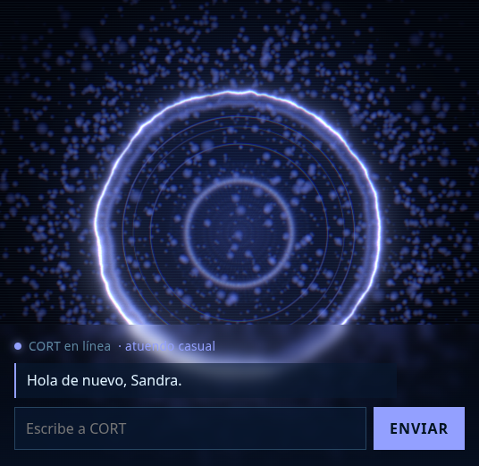

# CORT

**C**ognitive **O**perating **R**eactive **T**echnology — un asistente personal holográfico, **local-first**, inspirado en Cortana (*Halo*).

No una maqueta: un orbe de shader que respira, una memoria que sobrevive al apagar, un cerebro que puede ser un modelo tuyo o un chat local, y una capa de permisos que hace las cosas en el sistema real. Corre en un portátil de **1,8 GiB de RAM y sin tarjeta gráfica**, porque si corriera en una máquina de 128 GiB no valdría nada como prueba de concepto.

**Prototipo actual: `v0.1.0`** · rama `cort-local-verified` · 67 pruebas en verde.



---

## Qué hace hoy, y cómo se sabe

Cada fila de esta tabla se ejecutó en la máquina de desarrollo; nada está deducido de leer el código.

| | Qué ocurre | Cómo está verificado |
|---|---|---|
| 🔮 | **Reactor holográfico**: anillo de plasma en GLSL, polvo de 4000 puntos, bloom, aberración cromática, líneas de barrido. Paleta azul/violeta Cortana, cinco atuendos | Capturas reales a `localhost:5173`; **18 fps sin GPU** |
| 💬 | **Chat por WebSocket** contra un core Python/FastAPI | Cliente real + pruebas de protocolo |
| 🧠 | **Memoria persistente** (SQLite). Se mata el proceso, al levantarlo saluda: *"Hola de nuevo, Sandra"* | Probado matando y reiniciando el proceso |
| 🗣️ | **Cerebro local con Ollama** y **cadena de sustitución**: responde el primer modelo que funcione, y los que no caben en RAM se descartan antes de intentarlos | 10 pruebas con un Ollama de mentira; medición real del LLM |
| ⚡ | **Acciones reales en el sistema** a través de una capa de permisos: cambia el volumen con `wpctl` y **lee el nivel antes y después** para no fingir un éxito | Verificado por WebSocket contra `pipewire` |
| ✨ | **Efectos de un solo disparo**: onda al ejecutarse algo, desgarro al fallar | `MutationObserver` en el navegador |
| 🎨 | **Atuendo por hora y temperatura**, igual que el holograma de Cortana | Pruebas de lógica |
| 📱 | **Interfaz preparada para táctil** (pulsaciones de 48 px, sin auto-zoom, `safe-area`) | Escrita, **sin verificar en un móvil real** |

Lo que **todavía no está**, dicho en vez de simulado: voz, avatar VRM, gestos con cámara y control de apps. Motivos concretos en [`docs/FUNCTIONS.md`](docs/FUNCTIONS.md) y [`docs/STATUS.md`](docs/FUNCTIONS.md).

---

## Arranque rápido

```bash
make setup     # crea el venv e instala las dependencias del core
make test      # 67 pruebas
make dev       # core en http://127.0.0.1:8765   (WebSocket en /ws)

make web-deps  # primera vez: npm ci en apps/web
make web       # interfaz en http://localhost:5173
```

Abre `http://localhost:5173` y escribe. **Sin Ollama CORT sigue funcionando** en modo eco: la interfaz, la memoria y los intents no dependen del modelo.

Para que responda un modelo local:

```bash
ollama serve                       # no arranca solo
ollama pull qwen2.5:0.5b           # 379 MiB: el que cabe en esta máquina
CORT_LLM_CHAIN=qwen2.5:0.5b make dev
```

Configuración por variables de entorno (no hay cargador de `.env` todavía): [`docs/ARCHITECTURE.md`](docs/ARCHITECTURE.md#capa-de-permisos-actionspy--regla-6-de-agentsmd) y `.env.example`.

## La interfaz

Un solo cuadro de mando: el reactor en el centro, el chat abajo. Todo el color sale de **un único sitio** (`apps/web/src/cort/palette.ts`), así que la onda, el HUD y el anillo nunca discuten. El estado viaja por WebSocket en dos capas deliberadamente separadas —un snapshot inmutable para React y un objeto mutable que la escena persigue con `lerp`—, que es lo que hace que cambiar de atuendo **respire** en vez de parpadear.

Sin `zustand`, sin `@react-three/drei`, sin framework de UI. Cada dependencia es memoria en una máquina que no tiene.

## Hardware: por qué el prototipo se ve así y no de otra forma

Medido, no supuesto:

- **2 núcleos a 1,46 GHz · 1,8 GiB de RAM · sin GPU.** El reactor va a **18 fps**. El LLM genera a **~1,3 tokens/s**: un turno normal cuesta 15-60 s.
- **Nada de más de ~700 MiB entra en la cadena de modelos.** Cargar uno de 2,6 GB **congeló la máquina**.
- **Sin salida de audio usable**: el único chip es HDMI y el puerto está `not available`, así que el sink es *Dummy Output*. Por eso la voz es Fase 2 y no "un modelo más": aquí no se puede oír.
- Consecuencia de método: **se mide antes de prometer**. Las fases de voz, VRM y gestos llevan esa advertencia en el roadmap.

## Documentación

| Documento | Para qué |
|---|---|
| [`docs/STATUS.md`](docs/STATUS.md) | **Fuente de verdad operativa**: qué funciona de verdad, qué se intentó y falló, qué deuda hay |
| [`docs/ARCHITECTURE.md`](docs/ARCHITECTURE.md) | Capas, protocolo WebSocket, capa de permisos, módulos de `apps/web` |
| [`docs/ROADMAP.md`](docs/ROADMAP.md) | Nueve fases, cada una con su criterio de "listo" |
| [`docs/FUNCTIONS.md`](docs/FUNCTIONS.md) | Las ~60 funciones con estado y viabilidad por sistema operativo |
| [`docs/VISION.md`](docs/VISION.md) | Qué se traduce de Cortana a algo real |
| [`docs/DEVELOPMENT-GUIDE.md`](docs/DEVELOPMENT-GUIDE.md) | Método de trabajo |
| [`docs/AI-COPILOT-GUIDE.md`](docs/AI-COPILOT-GUIDE.md) | Cómo repartir cuota entre copilotos |
| [`AGENTS.md`](AGENTS.md) | Las reglas que cualquier agente de código debe leer antes de tocar nada |

## Créditos

**Creadores:** **Sandra Lopez** y **Askher Vargas**.

CORT se construye encima de trabajo ajeno, con licencia y atribución:

| Origen | Licencia | Qué se aprovechó |
|---|---|---|
| [adewaskar/JARVIS](https://github.com/adewaskar/jarvis) | **MIT** | Código copiado y adaptado: el reactor GLSL, las partículas, el post-proceso y la capa de efectos. Detalle de los cambios en [`apps/web/CREDITS.md`](apps/web/CREDITS.md) |
| [OpenJarvis](https://github.com/open-jarvis/OpenJarvis) | **Apache-2.0** | Ideas y estructura de servicios |
| Rama `scaffold/fastapi-ollama-frontend` de este mismo repo | propia | La memoria SQLite, reescrita (ruta inyectable, deduplicación, búsqueda por raíces) |
| [jaredrhod/fullstack-agent](https://github.com/jaredrhod/fullstack-agent) | **AGPL-3.0** | **Ningún código**: leer ideas sí, copiar no. Enlazar AGPL arrastraría a CORT a AGPL |
| [Halo](https://www.xbox.com/es-ES/games/halo) / Microsoft | — | Cortana es inspiración estética y de concepto. CORT es un proyecto independiente y no está afiliado |

## Licencia

MIT — © 2026 **Sandra Lopez** y **Askher Vargas**. Ver [`LICENSE`](LICENSE) y [`CREDITS.md`](CREDITS.md).
