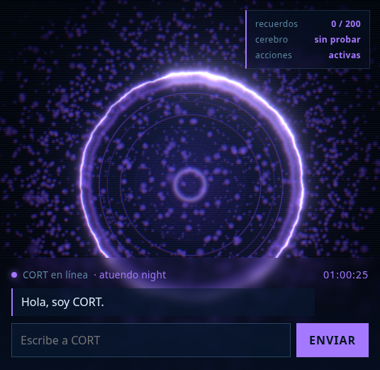

# CORT

**C**ognitive **O**perating **R**eactive **T**echnology — un asistente personal holográfico, **local-first**, inspirado en Cortana (*Halo*).

No una maqueta: un orbe de shader que respira, una memoria que sobrevive al apagar, un cerebro que puede ser un modelo tuyo o un chat local, y una capa de permisos que hace las cosas en el sistema real. Corre en un portátil de **1,8 GiB de RAM y sin tarjeta gráfica**, porque si corriera en una máquina de 128 GiB no valdría nada como prueba de concepto.

**Prototipo actual: `v0.4.3`** · rama `cort-local-verified` · **133 pruebas en verde** · licencia MIT · creadores **Sandra Lopez** y **Askher Vargas**.



---

## Arquitectura

Tres capas, un protocolo, y todo en la misma máquina. Ningún dato sale del equipo salvo que tú configures un modelo remoto (no es el caso).

```
        Usuario (voz* · teclado · táctil)
                     │
   ┌─────────────────▼──────────────────┐
   │  apps/web   React 19 · Vite · TS   │  interfaz: reactor GLSL, HUD, chat,
   │  Three.js r185 · post-proceso      │  telemetría, efectos, PWA
   └─────────────────▲──────────────────┘
                     │  WebSocket JSON (ws://127.0.0.1:8765/ws)
   ┌─────────────────┴──────────────────┐
   │  services/core   Python 3.13       │  FastAPI + websockets, sin framework
   │  brain · intents · actions ·       │  de app: un módulo por responsabilidad
   │  memory · status · outfit          │
   └───▲──────────────▲─────────────▲───┘
       │              │             │
   Ollama        SQLite         capa de permisos
   (LLM local)   (memoria)      (wpctl · scrot · xdotool · apps)
                                     │
                               sistema real

   * voz: diseñada y bloqueada por hardware en esta máquina — ver Funciones
```

Un mensaje recorre el sistema así (cada paso está probado, `test_protocol.py`):

1. El cliente manda `{"type":"user_message","text":…}`.
2. `memory/facts.py` extrae hechos declarables («me llamo Sandra» → `El usuario se llama Sandra`) y `memory/store.py` los guarda **antes** de cualquier otra cosa.
3. `intents.py` mira si la frase es una orden local («baja el volumen»). Si lo es, **no se gasta el LLM**.
4. Si es una orden, `actions.py` la ejecuta por la lista cerrada de permisos y **comprueba el resultado en el mundo** (nivel de volumen, archivo en disco, recuento de procesos).
5. Si no, `brain.py` pregunta a Ollama con los recuerdos relevantes metidos como mensaje de sistema.
6. Vienen `assistant_message`, un `effect` (`pulse` si la acción fue, `glitch` si falló) y un `status` con lo que CORT puede afirmar de sí mismo.

## Componentes

| Componente | Archivo(s) | Qué hace |
|---|---|---|
| **Servidor y protocolo** | `services/core/cort_core/server.py` | FastAPI + WebSocket. Reparte los seis marcos que salen del core (y escucha el `user_message` que entra), arma el prompt con memoria y decide si el turno pasa por el modelo o por un atajo local. Toda llamada al sistema va en `await` sobre `asyncio.create_subprocess_exec`: un `subprocess.run` bloqueante pararía el bucle que atiende a los demás clientes |
| **Cerebro (LLM)** | `cort_core/brain.py` | Cadena de sustitución (`CORT_LLM_CHAIN`): usa el primer modelo que responda. Pide `/api/tags` y **descarta por tamaño** lo que no cabe en RAM (`CORT_LLM_MAX_MODEL_MIB`, 700 MiB) — cargar el de 2,6 GB congeló la máquina. Distingue «Ollama no está» de «la cadena no respondió». Sin modelo, modo eco |
| **Memoria persistente** | `cort_core/memory/{store,facts}.py` | SQLite con búsqueda por raíces de 4 letras (no embeddings: esos piden ~1,5 GiB). `remember · recall · context_for · prune · name_of_user · count`. `prune` protege la fila del nombre, de la que depende el saludo. `context_for` rescata **por contenido, no por fecha** |
| **Intenciones** | `cort_core/intents.py` | Patrones locales para órdenes de sistema. Devuelve una acción estructurada y **no ejecuta nada** — separar las dos cosas es lo que hace auditable el permiso |
| **Capa de permisos** | `cort_core/actions.py` | Convierte esa acción en un comando real **de una lista cerrada**, con argv fijo, verificación del resultado y apagador global. Es la frontera entre «CORT entendió» y «CORT lo hizo» |
| **Telemetría** | `cort_core/status.py` | Lee tres cosas y nada más: cuántos recuerdos hay, qué modelo habló la última vez y si los permisos están encendidos. Si un valor no se puede medir manda `null`, no un adorno |
| **Atuendo** | `cort_core/outfit.py` | El color del holograma según hora y temperatura, igual que el de Cortana |
| **Reactor holográfico** | `apps/web/src/scene/{Core,Particles,Scene}.tsx` | Un solo quad con shader de coordenadas polares (anillo erosionado por fbm, polvo, barrido radar) + Bloom, aberración cromática, ruido y viñeta. **18 fps sin GPU** |
| **Estado y conexión** | `apps/web/src/cort/{connection,palette}.ts` | Dos capas deliberadamente separadas: un *snapshot* inmutable para React (`useSyncExternalStore`) y un objeto mutable que la escena persigue con `lerp`. Por eso cambiar de atuendo **respira** en vez de parpadear. Un solo archivo define todo el color |
| **Interfaz** | `apps/web/src/ui/{Hud,Telemetry,Effects}.tsx` | Chat con reloj, panel de «lo que CORT sabe de sí mismo», capa de efectos de un solo disparo. Escritos **sin** `zustand`, `drei` ni `framer-motion`: cada dependencia es RAM que esta máquina no tiene |
| **Capa instalable** | `apps/web/public/manifest.webmanifest`, `public/icons/` | `display: standalone`, tema `#02040c` y cuatro iconos generados con código propio a partir de `palette.ts`. **Sin service worker a propósito**: cachear una interfaz que depende del core daría un CORT que parece vivo sin estarlo |
| **Lanzador** | `scripts/cort.py` + `CORT.desktop` + `cort.bat` | La única puerta soportada para encenderlo todo: banner de marca y **cinco barras de estado** (core · interfaz · ollama · memoria · **audio**). Sin dependencias, ANSI con la estándar. `--demo` manda la memoria a `/tmp` |
| **Pruebas** | `services/core/tests/` | 133, con la biblioteca estándar. El Ollama se finge con `httpx.MockTransport` y el ejecutor de acciones con un `runner` inyectable: **la suite no le mueve el audio ni le escribe la memoria a nadie** |

## Protocolo WebSocket

`ws://127.0.0.1:8765/ws`, JSON plano: **siete tipos**, uno entrante y seis salientes. Los tipos nuevos se escriben aquí y en `docs/ARCHITECTURE.md` **antes** de programarlos (regla 5 de `AGENTS.md`).

| Tipo | Dirección | Lleva | Quién lo pinta |
|---|---|---|---|
| `user_message` | cliente → core | `text` | — |
| `state` | core → cliente | `outfit`, `mood`, `thinking` | reactor y HUD |
| `greeting` | core → cliente | `text`, `mood` | el chat, **sólo si el registro está vacío** (viaja separado de `assistant_message` porque el core lo manda en cada reconexión) |
| `assistant_message` | core → cliente | `text`, `mood` | el chat |
| `intent` | core → cliente | `action`, `delta`/`app` | trazabilidad de la orden |
| `effect` | core → cliente | `kind` ∈ `glitch · pulse · scan · shake · flash` | capa de efectos (no se guarda: es puntuación, no estado) |
| `status` | core → cliente | `memories`, `keep`, `brain`, `ollama`, `actions` | panel de telemetría |

## Seguridad y permisos

Lo que hace a esto una capa de permisos y no un `subprocess` suelto:

1. **Lista cerrada.** Sólo hay cuatro mandos: `volume`, `media`, `screenshot`, `launch`. Todo lo demás responde «no está en la lista permitida» con un `glitch`, en vez de fingir un «entendido».
2. **argv fijo.** No existe `shell=True`, y ni el texto del usuario ni la salida del modelo entran en los argumentos: sólo un entero que sale de *nuestra* tabla de patrones y claves de una constante.
3. **El LLM no tiene herramientas.** `brain.py` devuelve texto y ese texto se pinta. No hay camino del modelo al shell.
4. **Se puede apagar sin tocar código:** `CORT_SYSTEM_ACTIONS=0`.
5. **El resultado se comprueba, no se supone:** el nivel se lee antes y después, la captura se mira en disco, la app se cuenta con `pgrep`. Un `returncode` 0 no es una prueba.
6. **Datos personales fuera de git.** La base vive en `services/core/data/` (ignorada), `.env` está ignorado, y las claves no se suben nunca. Para enseñar CORT a otra persona existe `--demo`.

## Funciones

El inventario completo, con estado y viabilidad por sistema operativo, está en [`docs/FUNCTIONS.md`](docs/FUNCTIONS.md). Resumen medido hoy:

| Grupo | Funciones | Hechas | En curso | Pendientes |
|---|---|---|---|---|
| Núcleo (chat, memoria, intents, clima, búsqueda…) | 10 | 4 | 0 | 6 |
| Voz y audio (wake word, STT, TTS, volumen, reproductor…) | 13 | 1 | 2 | 10 |
| Avatar y HUD (partículas, VRM, atuendo, overlay, efectos) | 12 | 3 | 3 | 6 |
| Gestos y visión (MediaPipe, rostro, descripción de cámara) | 4 | 0 | 0 | 4 |
| Control de dispositivos (apps, brillo, captura, notificaciones…) | 7 | 1 | 1 | 5 |
| Sensores y contexto (temperatura, red, MQTT, preferencias) | 9 | 0 | 0 | 9 |
| **Total** | **55** | **9** | **6** | **40** |

Las cifras las cuenta `docs/FUNCTIONS.md`, que es el inventario largo con la evidencia de cada fila.

Lo que **todavía no está**, dicho en vez de simulado: **voz**, **avatar VRM** y **gestos con cámara**. Los tres motivos son de hardware y están medidos en esta máquina (sin dispositivo de captura, sink en *Dummy Output*, 2 núcleos a 1,46 GHz), no son «falta de código». Ver [`docs/PLATFORM.md`](docs/PLATFORM.md).

## Qué hace hoy, y cómo se sabe

Cada fila de esta tabla se ejecutó en la máquina de desarrollo; nada está deducido de leer el código.

| | Qué ocurre | Cómo está verificado |
|---|---|---|
| 🔮 | **Reactor holográfico**: anillo de plasma en GLSL, polvo de 4000 puntos, bloom, aberración cromática, líneas de barrido. Paleta azul/violeta Cortana, cinco atuendos | Capturas reales a `localhost:5173`; **18 fps sin GPU** |
| 💬 | **Chat por WebSocket** contra un core Python/FastAPI | Cliente real + 8 pruebas de protocolo |
| 🧠 | **Memoria persistente** (SQLite). Se mata el proceso, al levantarlo saluda: *"Hola de nuevo, Sandra"*. Y al armar el prompt **rescata por contenido, no por fecha**: con 303 recuerdos de prueba los tres datos del usuario van delante, no los seis más recientes | Probado matando y reiniciando el proceso; 28 pruebas de memoria, una cronometrada en 2,42 ms |
| 🗣️ | **Cerebro local con Ollama** y **cadena de sustitución**: responde el primer modelo que funcione, y los que no caben en RAM se descartan antes de intentarlos | 10 pruebas con un Ollama de mentira; medición real del LLM |
| ⚡ | **Acciones reales en el sistema** a través de la capa de permisos: cambia el volumen con `wpctl` y **lee el nivel antes y después**; hace una **captura de pantalla** con `scrot` y **comprueba el archivo**; **abre aplicaciones** de una lista cerrada y lo confirma contando el proceso nuevo | Verificado por WebSocket contra PipeWire, contra disco (PNG real de 1366×768) y contra `pgrep`: `xfce4-terminal` pasó de 0 a 1 procesos con CORT diciendo «Abriendo la terminal», y a la segunda «La terminal ya estaba en marcha» |
| ✨ | **Efectos de un solo disparo**: onda al ejecutarse algo, desgarro al fallar | `MutationObserver` en el navegador |
| 📊 | **Panel de telemetría**: cuántos recuerdos hay y hasta dónde llegan, qué modelo contestó, si las acciones están encendidas. Con el apagador puesto el panel dice «apagadas» en vez de fingir. Y **reloj** en el cabezal del HUD | `test_status` (9) y `test_protocol` (8), y cliente real: `{"memories":1,"keep":200,"brain":null,"ollama":false,"actions":false}`. El reloj, medido: `00:25:04 → 00:25:07` en 2,1 s |
| 🖥️ | **Arranque de doble clic**: `CORT.desktop` en Linux, `cort.bat` en Windows, terminal con banner y **cinco barras** (core · interfaz · ollama · memoria · **audio**) | Lanzado de verdad: `dist` y `vite dev`, `--quiet` y salida redirigida. La barra de audio, ejecutada hoy: `0 salida(s): ninguna real (Dummy Output) · 0 entrada(s)`. **Sin verificar el doble clic en el escritorio XFCE** (lo maneja a mano Sandra) |
| 🎨 | **Atuendo por hora y temperatura**, igual que el holograma de Cortana | Pruebas de lógica |
| 📱 | **Interfaz preparada para táctil y para instalarse** (pulsaciones de 48 px, sin auto-zoom, `safe-area`, `manifest.webmanifest` con `display: standalone` e iconos) | El manifiesto, servido y medido: `200 application/manifest+json`, JSON válido y consola sin avisos. Lo táctil y el botón «añadir a pantalla de inicio»: **sin verificar en un móvil real** — hace falta abrir el lanzador a la LAN y HTTPS, y eso es una decisión de seguridad, no de código |

## Plataforma: PC, móvil y por qué no C++/Java

CORT **ya es multiplataforma por arquitectura**, no por lenguaje: un core Python que habla por WebSocket + una interfaz web. El mismo código corre en Linux, Windows, macOS y en el navegador de un Android; cambiar de sistema operativo toca la capa de mandos (`actions.py`), no el lenguaje.

Electron, Capacitor, C++ y Java están **evaluados con números de esta máquina** en [`docs/PLATFORM.md`](docs/PLATFORM.md): un Chromium extra sobre 263 MB libres, y un `javac` que no existe. La pila es Python + React + Ollama y no cambia por una sugerencia externa (regla 13 de `AGENTS.md`); para alterarla hay que traer una medición nueva, no una opinión.

## Hardware: por qué el prototipo se ve así y no de otra forma

Medido, no supuesto:

- **2 núcleos a 1,46 GHz · 1,8 GiB de RAM · sin GPU.** El reactor va a **18 fps**. El LLM genera a **~1,3 tokens/s**: un turno normal cuesta 15-60 s.
- **Nada de más de ~700 MiB entra en la cadena de modelos.** Cargar uno de 2,6 GB **congeló la máquina**.
- **Sin salida de audio usable**: el único chip es HDMI y el puerto está `not available`, así que el sink es *Dummy Output*. Y **no hay ningún dispositivo de captura** (`arecord -l` vacío; las dos entradas que PipeWire lista bajo `Video` son cámaras). Por eso la voz es Fase 2 y no "un modelo más": aquí no se puede oír ni escuchar.
- Consecuencia de método: **se mide antes de prometer**. Cualquier fila nueva de esta tabla entra con su evidencia o dice «sin verificar».

## Estructura del repositorio

```
CORT/
├── services/core/
│   ├── cort_core/            # el cerebro: server · brain · intents · actions · status · outfit
│   │   └── memory/           # store.py (SQLite) + facts.py (extracción de hechos)
│   ├── tests/                # 133 pruebas, biblioteca estándar
│   ├── data/                 # memory.db — fuera de git: son datos personales
│   └── requirements.txt
├── apps/web/                 # React 19 + Vite + Three.js (src/cort · scene · ui · public/)
├── scripts/                  # cort.py (lanzador) · install-desktop.sh
├── docs/                     # STATUS · ARCHITECTURE · ROADMAP · FUNCTIONS · PLATFORM · VISION
├── upstream/                 # referencias de terceros: solo lectura, con licencia
├── CORT.desktop · cort.bat   # doble clic en Linux y Windows
├── Makefile · AGENTS.md · CREDITS.md · LICENSE
```

## Arranque rápido

```bash
make setup     # crea el venv e instala las dependencias del core
make test      # 133 pruebas (~50 s: la poda mete 300 recuerdos de verdad)
make launch    # TODO: core + interfaz + navegador, con terminal de marca
```

`make launch` es lo que hace el doble clic: levanta el core, sirve la interfaz y abre el navegador. Si `apps/web/dist` está construido (`make web-build`) se sirve desde ahí y no se gasta los ~120 MB que cuesta Vite en modo desarrollo. `Ctrl+C` cierra los dos procesos.

```bash
make dev       # solo el core, en http://127.0.0.1:8765   (WebSocket en /ws)
make demo      # como make launch, pero con memoria de usar y tirar en /tmp
make web-deps  # primera vez: npm install en apps/web
make web       # interfaz en http://localhost:5173, con recarga en caliente
```

### Doble clic

- **Linux (XFCE/GNOME/KDE):** `./scripts/install-desktop.sh` escribe `CORT.desktop` en la raíz del proyecto —con la ruta absoluta de *esta* máquina, por eso ese archivo está en `.gitignore`— y lo instala en el menú. Con `--desktop` además lo pone en el Escritorio ya marcado como confiable.
- **Windows:** `cort.bat`. Busca el `.venv` y, si no está, avisa en vez de cerrar la ventana sin decir nada. **Sin verificar en Windows real**: aquí solo hay Linux.

**Sin Ollama CORT sigue funcionando** en modo eco: la interfaz, la memoria y los intents no dependen del modelo. Para que responda un modelo local:

```bash
ollama serve                       # no arranca solo
ollama pull qwen2.5:0.5b           # 379 MiB: el que cabe en esta máquina
CORT_LLM_CHAIN=qwen2.5:0.5b make dev
```

Configuración por variables de entorno: `.env.example` y [`docs/ARCHITECTURE.md`](docs/ARCHITECTURE.md#capa-de-permisos-actionspy--regla-6-de-agentsmd).

## Cómo colaborar

1. **Lee en este orden:** [`AGENTS.md`](AGENTS.md) (las 13 reglas) → [`docs/STATUS.md`](docs/STATUS.md) (fuente de verdad operativa: qué funciona *de verdad*) → [`docs/ROADMAP.md`](docs/ROADMAP.md) (nueve fases con su criterio de "listo").
2. **Una fase a la vez**, sin adelantar. Cada cierre lleva su prueba y actualiza `docs/STATUS.md` y, si cambia la cara pública, `README.md` en el **mismo commit** (regla 12).
3. **Prueba primero, código después, `make test` al final.** Nada se da por hecho por estar escrito en un chat.
4. **No se afirma sin ejecutar.** Si no puedes comprobarlo, escribe literalmente **"sin verificar"**.
5. Las decisiones de plataforma (escritorio, móvil, voz, lenguaje) están en [`docs/PLATFORM.md`](docs/PLATFORM.md): para cambiar una hay que traer un número de esta máquina.
6. Se trabaja sobre la rama **`cort-local-verified`**. `main` es historia de terceros y no se toca.

Tareas abiertas que no requieren hardware nuevo (orden sugerido, de más barata a más cara):

- **Cerrar el clima del HUD**: hoy es un `TODO` (`CORT_CITY_TEMP_C` en `server.py`, fijo en 22 °C); falta el proveedor y su prueba con HTTP simulado.
- **Memoria**: `remember()` deduplica sensible a mayúsculas — «Me llamo X» y «me llamo X» crean dos filas. Está anotado como deuda en `docs/STATUS.md`.
- **Acciones**: instalar `playerctl` convierte la función 18 (reproductor) en algo verificable con un «después» comprobable.
- **Voz (Fase 2)**: bloqueada hasta tener altavoz o auriculares **y** micrófono. El código existe en el roadmap y no se simula.
- **Móvil**: abrir el core a la LAN con HTTPS es una decisión de seguridad de Sandra, no un ticket de código.

## Documentación

| Documento | Para qué |
|---|---|
| [`docs/STATUS.md`](docs/STATUS.md) | **Fuente de verdad operativa**: qué funciona de verdad, qué se intentó y falló, qué deuda hay |
| [`docs/ARCHITECTURE.md`](docs/ARCHITECTURE.md) | Capas, protocolo, capa de permisos, módulos de `apps/web` — con el por qué de cada decisión |
| [`docs/ROADMAP.md`](docs/ROADMAP.md) | Nueve fases, cada una con su criterio de "listo" |
| [`docs/FUNCTIONS.md`](docs/FUNCTIONS.md) | Las 55 funciones con estado y viabilidad por sistema operativo |
| [`docs/PLATFORM.md`](docs/PLATFORM.md) | Electron, Capacitor, PWA, C++/Java y voz: qué se puede hacer aquí y con qué número |
| [`docs/VISION.md`](docs/VISION.md) | Qué se traduce de Cortana a algo real |
| [`docs/DEVELOPMENT-GUIDE.md`](docs/DEVELOPMENT-GUIDE.md) | Método de trabajo |
| [`docs/AI-COPILOT-GUIDE.md`](docs/AI-COPILOT-GUIDE.md) | Cómo repartir cuota entre copilotos |
| [`AGENTS.md`](AGENTS.md) | Las reglas que cualquier agente de código debe leer antes de tocar nada |

## Créditos

**Creadores:** **Sandra Lopez** y **Askher Vargas**.

CORT se construye encima de trabajo ajeno, con licencia y atribución:

| Origen | Licencia | Qué se aprovechó |
|---|---|---|
| [adewaskar/JARVIS](https://github.com/adewaskar/jarvis) | **MIT** | Código copiado y adaptado: el reactor GLSL, las partículas, el post-proceso y la capa de efectos. Detalle de los cambios en [`apps/web/CREDITS.md`](apps/web/CREDITS.md) |
| [OpenJarvis](https://github.com/open-jarvis/OpenJarvis) | **Apache-2.0** | Ideas y estructura de servicios |
| Guía de inicio de @Xvirus (Proyecto Jarvis) | — | Evaluada pieza por pieza contra esta máquina en `docs/PLATFORM.md` |
| Rama `scaffold/fastapi-ollama-frontend` de este mismo repo | propia | La memoria SQLite, reescrita (ruta inyectable, deduplicación, búsqueda por raíces) |
| [jaredrhod/fullstack-agent](https://github.com/jaredrhod/fullstack-agent) | **AGPL-3.0** | **Ningún código**: leer ideas sí, copiar no. Enlazar AGPL arrastraría a CORT a AGPL |
| [Halo](https://www.xbox.com/es-ES/games/halo) / Microsoft | — | Cortana es inspiración estética y de concepto. CORT es un proyecto independiente y no está afiliado |

## Licencia

MIT — © 2026 **Sandra Lopez** y **Askher Vargas**. Ver [`LICENSE`](LICENSE) y [`CREDITS.md`](CREDITS.md).
